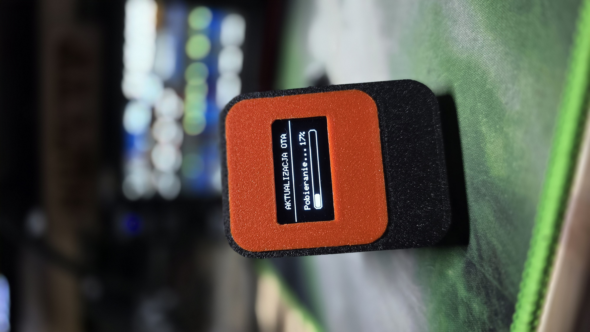
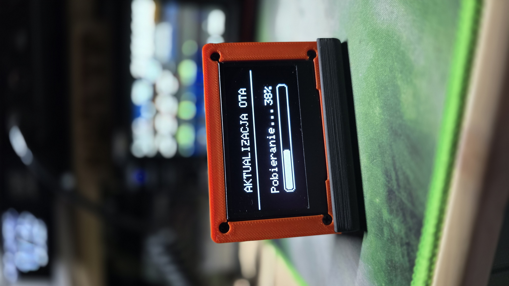
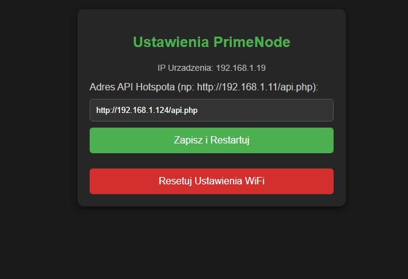
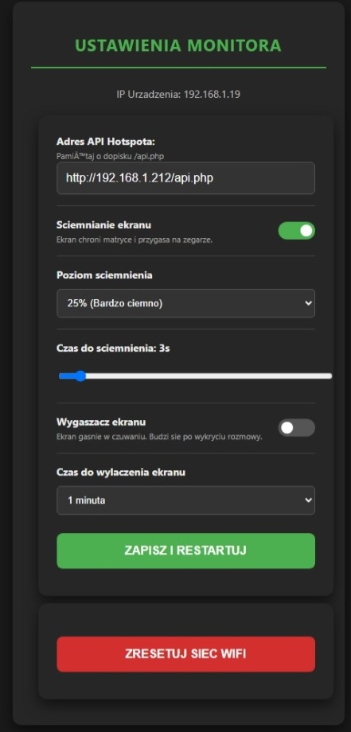

# 📺 PrimeNode Monitor (OLED System)
### The official companion display for PrimeNode Hotspots

**PrimeNode Monitor** to dedykowane oprogramowanie dla mikrokontrolerów ESP8266 (Wemos D1 Mini), które zamienia wyświetlacz OLED w profesjonalne centrum monitoringu Twojego węzła radiowego. System został zaprojektowany do współpracy z oprogramowaniem **PrimeNode**.

Wspieramy dwie wersje sprzętowe: kompaktową **1.3"** oraz dużą, czytelną **2.42"**.

---

## 📝 Changelog / Co nowego (Aktualizacja: Czerwiec 2026)
W najnowszej wersji oprogramowania (V1.4) wprowadzono potężne usprawnienia ułatwiające obsługę i poprawiające żywotność sprzętu:
* **🔋 Zaawansowane zarządzanie matrycą (Nowość!):** Wbudowano prawdziwe, sprzętowe ściemnianie (Hardware Dimming) dla układów SSD1306/SSD1309 oraz inteligentny wygaszacz ekranu (Screensaver). Ekran potrafi teraz obniżyć jasność lub całkowicie się wyłączyć po zadanym czasie spoczynku. Gdy tylko ktoś naciśnie PTT, matryca w ułamku sekundy wraca do pełnej jasności.
* **🎛️ Rozbudowany Panel WWW:** Web Config zyskał nowy, bogaty interfejs! Z poziomu przeglądarki możesz teraz włączać/wyłączać wygaszacz, ustawiać progi jasności (25%, 50%, 75%) i regulować czasy opóźnień za pomocą wygodnych suwaków i rozwijanych list.
* **☁️ Auto OTA Updates:** Urządzenie przy każdym starcie automatycznie łączy się z GitHubem i sprawdza dostępność nowej wersji oprogramowania. Jeśli taka istnieje, pobiera ją bezprzewodowo, wyświetlając dedykowany pasek postępu.
* **📜 Animowany tekst (Marquee):** Długie nazwy reflektorów (powyżej 10 znaków) nie są już ucinane – tekst automatycznie i estetycznie przewija się na górnej belce ekranu.
* **🛡️ Smart Watchdog:** Jeśli Hotspot straci zasilanie lub zniknie z sieci, Monitor po 10 sekundach automatycznie wyczyści "zamrożone" dane rozmówcy i przejdzie w tryb awaryjny (OFFLINE + Zegar).

---

## 📸 Podgląd / Preview

---

## ✨ Funkcje / Features

* **📊 Live Status:** Wyświetla aktualny tryb (Online/Offline), temperaturę CPU i nazwę sieci.
* **📡 Active Talker:** Natychmiast pokazuje Znak (Callsign) i Grupę (TG) osoby nadającej.
* **🕒 Smart Clock:** Gdy nikt nie rozmawia, wyświetla duży, czytelny zegar z datą.
* **📶 WiFi Manager & Web Panel:** Konfiguracja sieci przez AP oraz nowoczesny panel www do zmiany zaawansowanych ustawień w locie (Brak konieczności edycji kodu!).
* **☁️ Aktualizacje OTA:** Bezobsługowe, automatyczne pobieranie najnowszego wsadu prosto z GitHuba z animowanym paskiem postępu.
* **🎨 Visuals:** Przewijane nazwy, logo startowe PNL, inteligentne wygaszanie.
* **🛠️ Easy Flash:** Dostępny jako gotowy plik `.bin` - nie musisz programować!

---

## 🖼️ Galeria Wersji / Version Gallery

Poniżej przedstawiamy porównanie obu obsługiwanych wersji wyświetlaczy.

### 1. Ekran Startowy i Logo

| Wersja 1.3" (I2C) | Wersja 2.42" (SPI) |
| :---: | :---: |
|  |  |
|  |  |

### 2. Tryb Pracy (Zegar i Nasłuch)

| Wersja 1.3" (I2C) | Wersja 2.42" (SPI) |
| :---: | :---: |
|  |  |
|  |  |

### 3. Aktualizacja OTA (Over-The-Air)

| Wersja 1.3" (I2C) | Wersja 2.42" (SPI) |
| :---: | :---: |
|  |  |

---

## 📥 Pobieranie / Download

Wybierz wersję oprogramowania pasującą do Twojego wyświetlacza.
*Choose the firmware version corresponding to your display hardware.*

| Wersja / Version | Opis / Description | Plik / File |
| :--- | :--- | :--- |
| **1.3" SH1106 (I2C)** | Standardowy mały OLED 1.3 cala (4 piny). | [📥 Pobierz .bin](https://github.com/ArduUTP/PrimeNode_Monitor_OLED_1.3_2.42_BY_SQ7UTP/raw/refs/heads/main/firmware/PrimeNode_Monitor_OLED1.3_V1.2_By_SQ7UTP.bin) |
| **2.42" SSD1306 (SPI)** | Duży OLED 2.42 cala (złącze SPI, 7 pinów). | [📥 Pobierz .bin](https://github.com/ArduUTP/PrimeNode_Monitor_OLED_1.3_2.42_BY_SQ7UTP/raw/refs/heads/main/firmware/PrimeNode_Monitor_OLED2.42_V1.4_By_SQ7UTP.bin) |

> **Narzędzie do wgrywania:**
> Do wgrania pliku `.bin` użyj darmowego programu **NodeMCU PyFlasher**.
> [📥 Pobierz NodeMCU PyFlasher (Windows)](https://github.com/ArduUTP/PrimeNode_Monitor_OLED_1.3_2.42_BY_SQ7UTP/raw/refs/heads/main/tools/NodeMCU-PyFlasher.rar) *lub* [Pobierz z oficjalnej strony](https://github.com/marcelstoer/nodemcu-pyflasher/releases)

---

## 🔌 Schemat Podłączenia / Wiring Guide

Podstawą projektu jest moduł **Wemos D1 Mini (ESP8266)**. Poniżej znajdziesz schematy oraz zdjęcia wnętrza gotowych urządzeń.

### 🔹 Wersja 1.3" (I2C - SH1106)
Połączenie 4-przewodowe. Najprostsza wersja do wykonania.

| OLED Pin | Wemos D1 Mini Pin | Uwagi / Notes |
| :---: | :---: | :--- |
| **VCC** | **3.3V** | ⚠️ Nie podłączaj pod 5V! |
| **GND** | **GND** | Masa |
| **SCL** | **D1** (GPIO 5) | Zegar |
| **SDA** | **D2** (GPIO 4) | Dane |

  
  

### 🔹 Wersja 2.42" (SPI - SSD1306)
Dla dużych wyświetlaczy posiadających złącze 7-pinowe (SPI). Wymaga przylutowania zworek (R) na tyle wyświetlacza w tryb SPI (zazwyczaj domyślny).

| OLED Pin | Wemos D1 Mini Pin |
| :---: | :---: |
| **GND** | **GND** |
| **VCC** | **3.3V** |
| **SCL / D0** | **D5** (CLK) |
| **SDA / D1** | **D7** (MOSI) |
| **RES** | **D0** (RST) |
| **DC** | **D6** |
| **CS** | **D8** |

  
  

---

## ⚡ Instrukcja Wgrywania / Flashing Guide

Nie potrzebujesz Arduino IDE.

  

### Krok po kroku:
1. Podłącz Wemos D1 Mini do komputera kablem USB.
2. Uruchom program **NodeMCU PyFlasher**.
3. Wybierz port COM swojego urządzenia.
4. W polu "Firmware" wybierz pobrany wcześniej plik `.bin` (odpowiedni dla Twojego ekranu).
5. Baud rate: **115200** lub **921600**.
6. Flash mode: **Dual Output (DOUT)**.
7. **⚠️ WAŻNE:** W opcji "Erase flash" wybierz **Yes, wipes all data**. Jest to kluczowe przy pierwszej instalacji, aby wyczyścić pamięć!
8. Kliknij **Flash NodeMCU**.

> **🛑 PO ZAKOŃCZENIU:** Gdy pasek postępu dojdzie do końca, **odłącz zasilanie (kabel USB) i podłącz je ponownie**, aby zrestartować urządzenie.

---

## ⚙️ Konfiguracja / Configuration

Po poprawnym wgraniu i restarcie, na ekranie zobaczysz logo startowe, a następnie komunikat o trybie konfiguracji (AP).

### 1. Pierwsza konfiguracja (Tryb AP)

| 1. Tryb AP (1.3") | 2. Tryb AP (2.42") |
| :---: | :---: |
|  |  |

1. Na telefonie lub komputerze wyszukaj sieci WiFi.
2. Połącz się z siecią o nazwie: `PrimeNode_Monitor`.
3. Automatycznie otworzy się strona konfiguracyjna (jeśli nie, wpisz w przeglądarce: `192.168.4.1`).

  
  

4. Kliknij **Configure WiFi**.
5. Wybierz swoją domową sieć WiFi i wpisz hasło.
6. W polu **Adres API Hotspota** wpisz adres IP swojego Orange Pi (PrimeNode).
                      **Przykładowo:**
   * ⚠️ **WAŻNE:** Musisz dopisać końcówkę `/api.php`!
   * ✅ Poprawny wpis: `http://192.168.1.50/api.php`
   * ❌ Błędny wpis: `192.168.1.50`
7. Przejdź w dół, aby skonfigurować opcje wygaszacza ekranu i ściemniania, a następnie kliknij **Save**. Monitor zrestartuje się i połączy z Twoim systemem.

| Połączono (1.3") | Połączono (2.42") |
| :---: | :---: |
|  |  |

### 2. Zmiana ustawień w locie (Panel WWW)

Jeśli w przyszłości zechcesz zmienić ustawienia ochrony matrycy (np. skrócić czas wygaszacza), zmienić router lub podłączyć monitor pod inny hotspot, nie musisz wgrywać kodu na nowo! Wystarczy skorzystać z rozbudowanego, wbudowanego Panelu WWW.

  
  

1. Sprawdź adres IP swojego urządzenia w logach routera domowego.
2. Wpisz ten adres IP w przeglądarce na komputerze lub telefonie (np. `http://192.168.1.100`).
3. W panelu możesz wygodnie zmienić adres docelowy API, dostosować czas pracy ekranu, ustawić próg ściemniania lub użyć czerwonego przycisku, aby całkowicie skasować ustawienia WiFi i wywołać portal konfiguracyjny.

---

## 🖨️ Obudowy (Druk 3D) / 3D Cases

Aby urządzenie wyglądało profesjonalnie, zalecam wydrukowanie dedykowanych obudów. Poniżej linki do projektów autorów, z których korzysta ten system.

### 🔹 Dla wersji 1.3"
Idealnie pasująca obudowa typu "Terminal".
🔗 **Pobierz:** [Terminal for SSD1306 1.3" OLED and Wemos D1 mini NEW (Printables)](https://www.printables.com/model/160473-terminal-for-ssd1306-13-oled-and-wemos-d1-mini-new)

### 🔹 Dla wersji 2.42"
Obudowa przystosowana do większego wyświetlacza.
🔗 **Pobierz:** [2.42in OLED case with optional platform (Printables)](https://www.printables.com/model/441957-242in-oled-case-with-optional-platform)

*Modele obudów są udostępniane na licencji CC BY-NC 4.0 przez ich autorów na platformie Printables. Projekt ten wykorzystuje je jako rekomendowane rozwiązanie.*

---

## 🤝 Wsparcie i Odpowiedzialność / Disclaimer

Projekt jest dodatkiem do systemu **[PrimeNode - OPI0 V1 Hotspot System](https://github.com/ArduUTP/PrimeNode_OPI0V1_V1.0)**.

* **Autor oprogramowania:** Marcin "Skrętka" **SQ7UTP**
* **Kontakt:** sq7utp@gmail.com

**Zasady użytkowania (Disclaimer):**
Oprogramowanie jest dostarczane w stanie "takim, jakie jest" (AS IS), bez jakiejkolwiek gwarancji. Autor nie ponosi odpowiedzialności za ewentualne szkody sprzętowe, błędy w działaniu lub skutki wynikające z nieprawidłowego podłączenia lub użytkowania urządzenia. Wszystkie modyfikacje sprzętowe i programowe wykonujesz na własną odpowiedzialność.

*Software is provided "AS IS", without warranty of any kind. Use at your own risk.*
